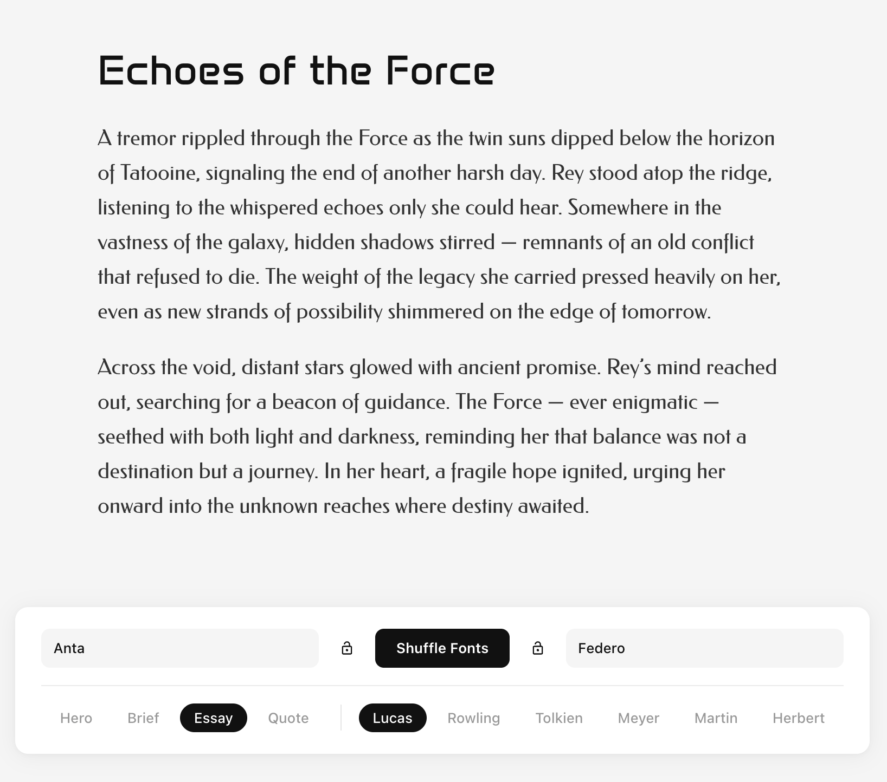
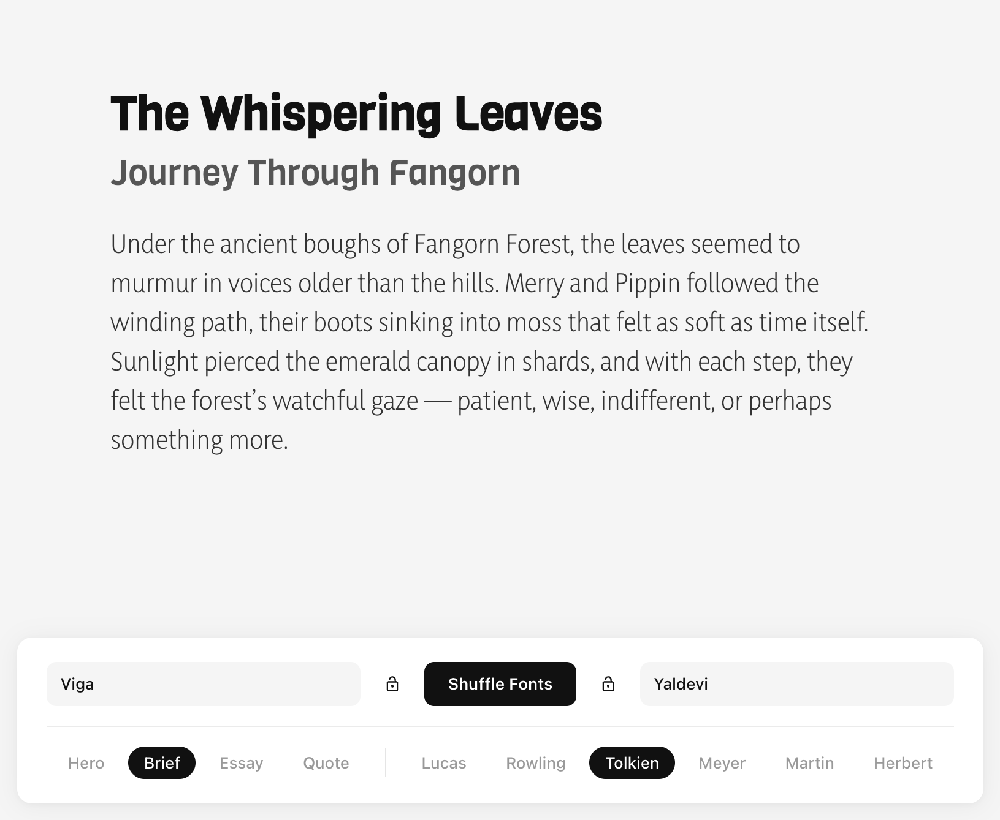
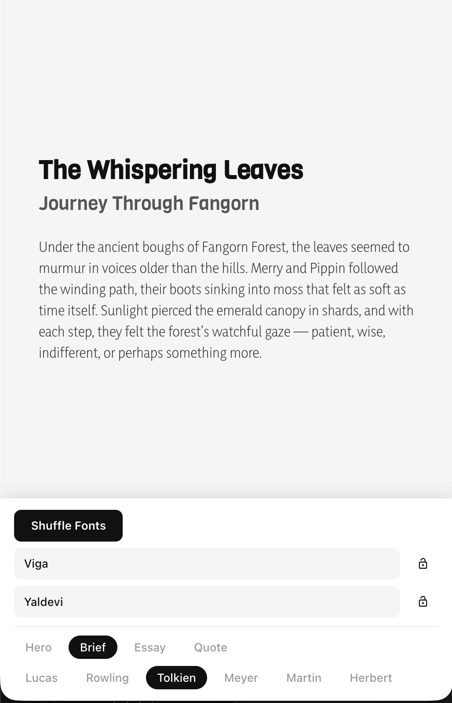

# Fonter

Fonter is a React app for testing font pairings in realistic content layouts. It lets you shuffle through the enitre google font library (1900+ fonts).

<table>
  <tr>
    <td></td>
    <td></td>
  </tr>
  <tr>
    <td></td>
    <td></td>
  </tr>
</table>

## Tech Stack

- React 19
- TypeScript
- Vite 7
- ESLint

## How To Run

### Prerequisites

- Node.js `^20.19.0 || >=22.12.0` (required by Vite 7 in this project)
- npm

### Commands

```bash

npm install # install dependencies
npm run dev # run in development mode
npm run build # build for prod
npm run preview # preview pord build
npm run lint # run code linter
```
